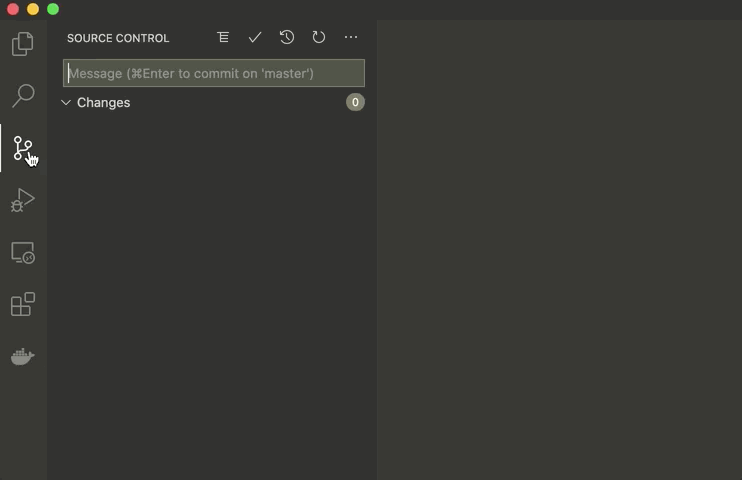
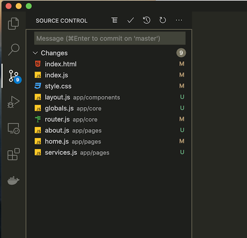

**Full-Stack Developer Path | Virtual Lab Activity | Week 2 | Github and Version Control | Feb 2021**

# Digital Future Leaders Program

### Let's create our own repository in GitHub

In the previous activity, we learned how to build a modern landing page website using only HTML, CSS and JavaScript without going deep into any of these topics. In this week's activity, we will tackle a different but very important topic called: Source Code.

To be specific: Open Source/Proprietary Software, Git, Version Control and GitHub

### Learning Objectives

By the end of this activity you will learn the following:

- Why knowing about Open Source software is important
- The differences between Open Source and Proprietary software
- List of interesting Open Source projects to know about
- How version control simplifies the process of software development
- How to use git in Visual Studio Code

### Why knowing about Open Source software is important

The Open Source software world is all about sharing and collaboration. You can read the code. Understand how it works. Maybe modify it. Or fix a bug.

Open Source software is a software which anyone can inspect its source code. What this means for developers, is they can easily modify them and redistribute them. And learn how things really work.

Detailed definition here: https://opensource.org/osd

Almost all major companies are relying on Open Source technology to run their business, especially the Linux operating system. So, this means it is something interesting to know about. Where to start from? 

I want to emphasis on the importance of knowing about open source software when it comes to learning new skills. You can always go around the Internet and read about open source and you will find out that, compared to other professions, learning programming is fairly easy due to the amount of knowledge that you can find online especially those that are open source.

If someone give you a proprietary (closed-source) software, you might struggle to improve your programming skills from just trying to figure out how it works. However, when it comes to open source projects, there are many different ways, and these are some of them:

1. Official Documentation: Usually it is recommended to have a rich and easy to read documentation for people to know how to the software
2. Posted Issues: Code hosting platform such as Github has Issues tab where people can post issues/bugs, sometimes requests for the main contributer to work on.
3. Online Communities: Stack Overflow, Dev.to, gitter.im

And of course, the many different kind of tutorials you will find online to leverage those open source technologies.

Did you know that you can build amazing things just by using open source technologies? You don't have to buy any kind of off-the-shelf software or some expensive SaaS (Software as a Service) just to build let's say a CCTV system, Cloud Storage, Multimedia Streaming system, Web Server to host your own apps, etc?

Does that mean Open Source software is better than Proprietary software?

### The differences between Open Source and Proprietary software

If you search for Open Source vs Proprietary, you'll find many resources to read and understand. It's a huge topic with many opinions and facts to know about, but let's tell a very simple story

You are the applications manager in a hospital, where you are responsible for all software applications used in the hospital. The hospital received new medical equipment with their own custom software installed by the vendor who made the equipment. The custom software needs internet connection to function properly, meaning it is also exposed to security vulnerabilities; meaning it needs to be constantly updated. 

Over time, the vendor responsible for this device went out of business and the custom software was out of support. Now the hospital is left our with these mission-critical medical equipment, that are exposed to security risks. The rest is history.

What could you have done to prevent this incident from happening? Maybe if open source software was considered, this incident could not have occured. Notice that one important strength of proprietary software is direct support from the vendor. The strength is even greater when the vendor is some highly reputable company.

Let's go back to present time and learn more about open source projects!

### List of interesting Open Source projects to know about

List down projects from Github

* https://github.com/vuejs/vue
* https://github.com/facebook/react
* https://github.com/twbs/bootstrap
* https://github.com/ohmyzsh/ohmyzsh
* https://github.com/flutter/flutter
* https://github.com/microsoft/vscode
* https://github.com/torvalds/linux
* https://github.com/airbnb/javascript
* https://github.com/golang/go
* https://github.com/nodejs/node
* https://github.com/angular/angular
* https://github.com/microsoft/TypeScript
* https://github.com/elastic/elasticsearch
* https://github.com/expressjs/express
* https://github.com/chrislgarry/Apollo-11
* https://github.com/bitcoin/bitcoin
* https://github.com/redis/redis
* https://github.com/rails/rails
* https://github.com/ansible/ansible
* https://github.com/pytorch/pytorch
* https://github.com/tensorflow/tensorflow
* https://github.com/sindresorhus/awesome
* https://github.com/donnemartin/system-design-primer
* https://github.com/danistefanovic/build-your-own-x
* https://github.com/d3/d3
* https://github.com/30-seconds/30-seconds-of-code
* https://github.com/awesome-selfhosted/awesome-selfhosted
* https://github.com/ripienaar/free-for-dev
* https://github.com/netdata/netdata
* https://github.com/leonardomso/33-js-concepts
* https://github.com/strapi/strapi
* https://github.com/discourse/discourse

### How version control simplifies the process of software development

I want to build a software using git, and I will follow a simple process:

1. Create a new repository on my Github account
2. I expect to have the following branches: prod, stg, dev
   1. prod is Production
   2. stg: Staging
   3. dev: Development
3. Then I will switch to dev branch
4. I will do my development on dev branch
5. I will be commiting/pushing code frequently to dev branch
6. When my dev branch is stable enough to be moved to stg branch, I will push it there
7. If stg branch is proved stable, it will move to prod branch, meaning Stable release
8. Repeat step 4!

This is a very simple git workflow. It is not the most ideal one but it gets the job done. And it is quite easy to adhere to. Still there is still one more point to keep an eye out for.

What if, I wanted to try out some feature, in some isolated branch? I can always create another branch from dev for example, I work on the feature, and then merge it. In fact, that's what versioning is all about.

Sometimes, you might run into conflicts. Let's say, some other developer pushed changes to the branch you are working on, while at the same time you were working on the files that were modified by that developer. But you didn't fetch those files. If you try to push, you'll get an error. Later we will explain how to merge conflicts in git.

Remember in the first activity, we used git from the terminal. Now you might think that you have to remember git commands. No, VS Code can do that job for us just fine.

### How to use git in Visual Studio Code

From the side menu, the 3rd icon, this is your Source Control tab. Here you will see a text field to write a useful message when you commit your code so that you remember and of course other developers know what this commit is all about.

Then you will see list of Staged Changes, Changes and Conflicts. By default only Changes are shown. And for the animated gif below, there are no changes.

The options button (three dots) is a GUI shortcut to frequently used git commands.

* Pull: download content from remote repository and update local code.
* Push: upload code to remote repository
* Clone: create a clone of existing repository
* Checkout to: switching branches
* Commit: save changes
* Changes: stage/unstage or discard changes (Dangerous Command)

Let's take a look at our previous activity status. Here we can see list of files that have been modified.

What we have to do next is to commit those changes and push them to our repository.