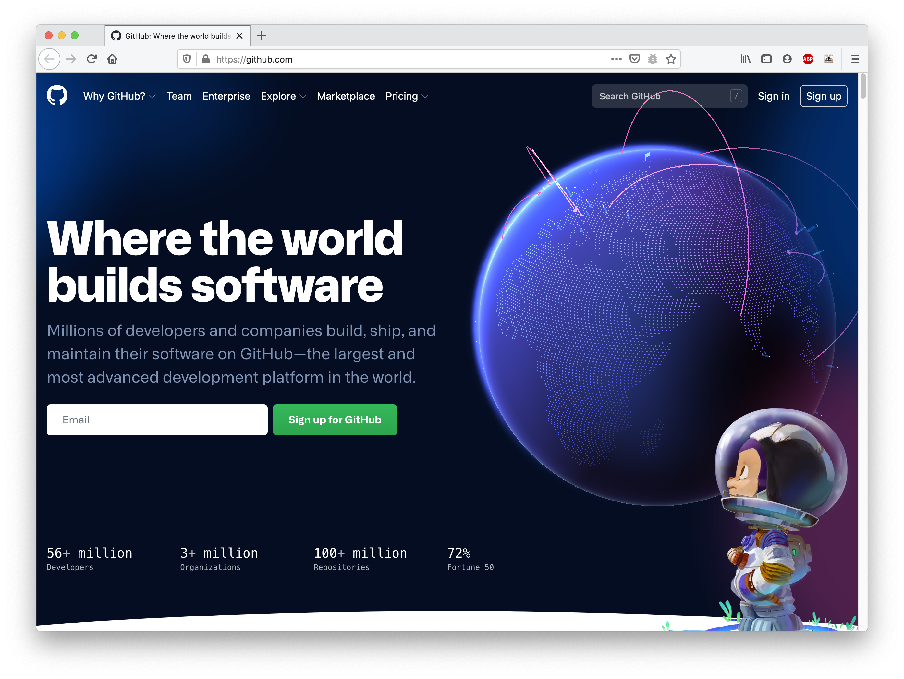
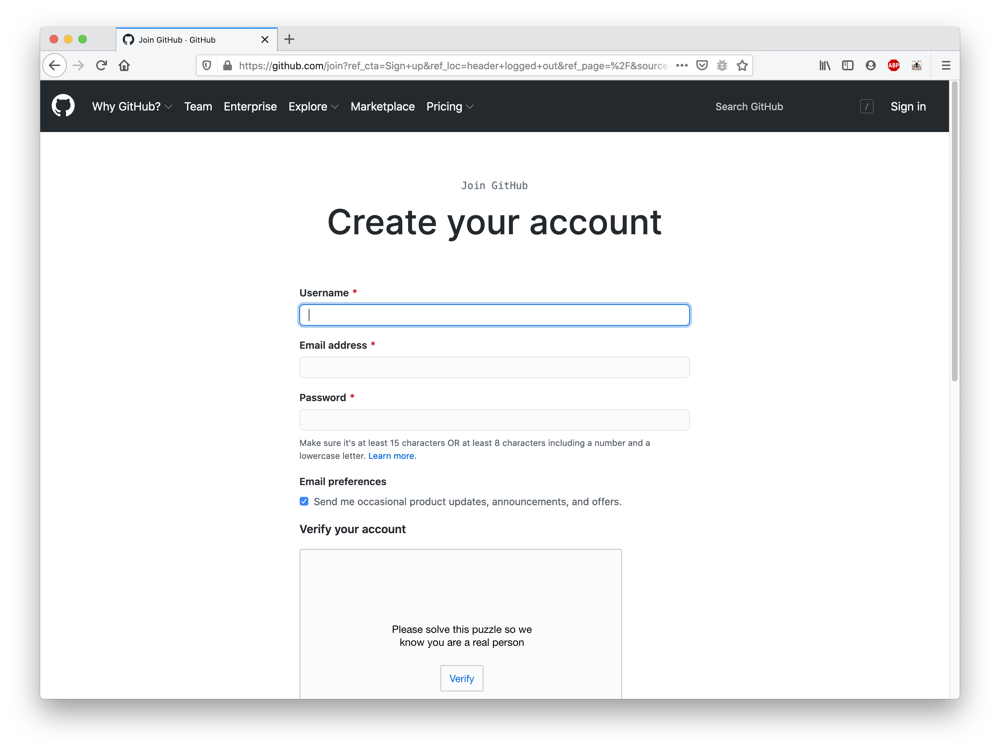
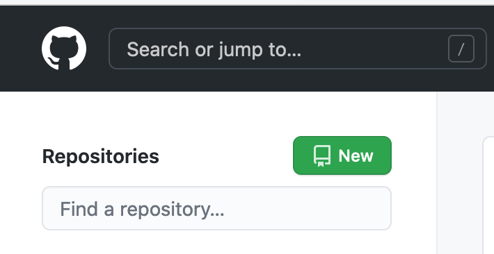
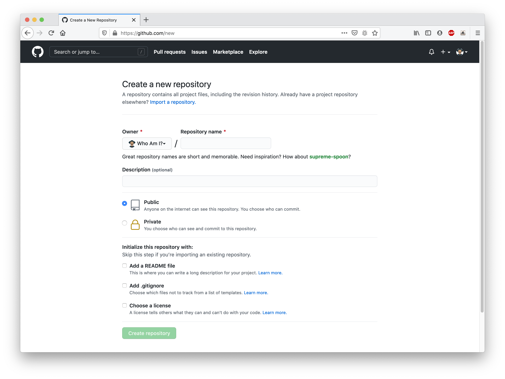
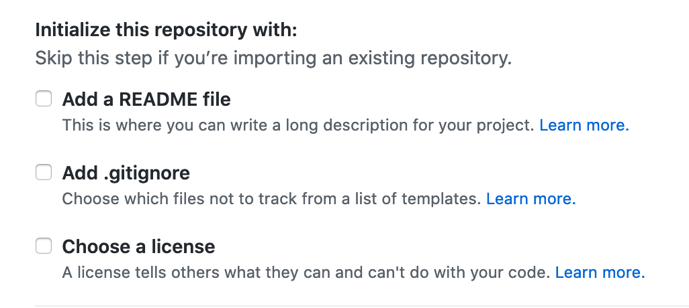
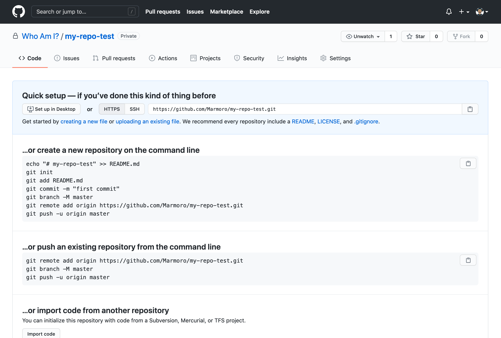

**Full-Stack Developer Path | Virtual Lab Activity | Week 3 | Useful Open Source Packages | Mar 2021**

# Digital Future Leaders Program

### Let's explore useful open source packages


In the previous session, we learned about the importance of Open Source in software industry. The differences between Open Source nad Proprietary software. How version control simplifies the process of software development, and how to use git.


In this week's activity, we will take another step forward and create our own GitHub account. And we will find out how we can use some open source packages that will help us build powerful applications.

### Learning Objectives

By the end of this activity you will learn the following:

- Create your own GitHub account
- Create some repositories under your GitHub account
- Install Node.js + NPM
- Install MySQL Server Community Edition
- Install Nginx
- Install express npm package as global package
- Install angular npm package as global package
- Install strapi npm package as global package
- Final Exercise: Use Strapi with Angular
- Bonus: Explore Realworld example apps (https://github.com/gothinkster/realworld)


### Title

Content


### Pre-requisites

* Access to a Virtual Machine with Ubuntu 20.04 installed


### Create your own GitHub account

First we will create a GitHub account so we can create some repositories your our account

Go to https://github.com/



Click on **Sign up** and complete registration process.



Once you have completed the registration, you should be able to create repositories under your account.


### Create some repositories under your GitHub account

After completing the registration process, from the top left, you should see New button. Click on it to see the repository creation form.



This is what the page should look like.




give your repository a meaningful name, try using kebab-case style. For a quick reference into cases, look at the screenshot below:


Source: https://marketplace.visualstudio.com/items?itemName=maximus136.change-string-case


Make sure you create an empty repository, meaning keeping these options unchecked.




Now, you should see this page with information on how you can initialize this repository.





##### Here is EXERCISE-01 : try to figure out how to push code to this repository 😎


### Install Node.js + NPM


Based on the pre-requisites we will be using Ubuntu 20.04. So to install Node.js, we can easily use this source:

https://github.com/nodesource/distributions


Make sure you start with

CMD-01

```
sudo apt-get update
```


### Install MySQL Server Community Edition

To install MySQL on Ubuntu 20.04, we can simply run the following commands, assuming we already ran the previous command CMD-01


CMD-02

```
sudo apt install mysql-server
```


Then to ensure it is running we can run this command

CMD-03

```
sudo systemctl status mysql.service
```


To start it we can run

CMD-04

```
sudo systemctl start mysql
sudo systemctl enable mysql
```

And that's it.

### Install Nginx

To install Nginx on Ubuntu 20.04, we can run the following commands:

CMD-05

```
sudo apt install nginx
sudo systemctl start nginx
sudo systemctl enable nginx
```

This should be enough. but we might have to configure UFW (Uncomplicated Firewall) program in Ubuntu, by running the following commands

```
sudo ufw allow 80/tcp
sudo ufw enable
sudo ufw status
```

This will ensure port 80 is allowed


At this point we are done installing these linux packages. Now we will install some node packages. These are differenet.

### Install express npm package as global package

We can find express js here https://expressjs.com/

I didn't include the steps here as they might change. Instead, this will be a chance for us to explore the documentation and figure out how to use it. This is an important skill for developers to harness! 👨‍💻


**Here is EXERCISE-02 : try to figure out how to install express and create a simple express application 😎**


### Install angular npm package as global package

https://angular.io/

Same here, we will be reading the documentation to find out how to use it.


**Here is EXERCISE-03 : try to figure out how to install angular and create a simple angular application 😎**


### Install strapi npm package as global package

https://strapi.io/


**Here is EXERCISE-04 : try to figure out how to install strapi and create a simple CMS application 😎** 

### Final Exercise: Use Strapi with Angular


https://strapi.io/documentation/developer-docs/latest/developer-resources/content-api/integrations/angular.html


### Bonus: Explore Realworld example apps (https://github.com/gothinkster/realworld)

Here we will explore this important repository in GitHub and extract useful knowledge from there.