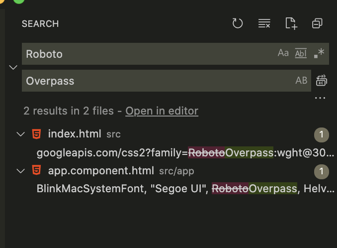
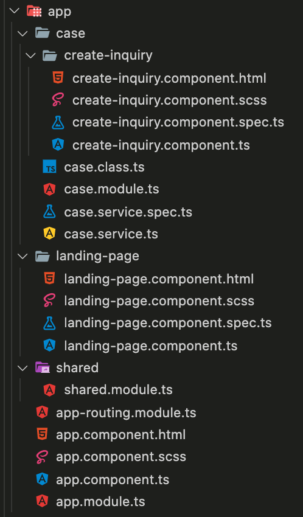

**Full-Stack Developer Path | Virtual Lab Activity | Week 4 | Front-end | Mar 2021**

# Digital Future Leaders Program

### Let's build a "CRM System For People" front-end application using [Angular](https://angular.io/)

### What we're trying to build


In the previous activity, we tried different kind of NPM packages such as express, strapi and angular. We also demonstrated how easy is it to install Nginx and MySQL in a linux machine.


In this activity, we will go deeper into Angular and build a useful front-end application that fulfills a certain business requirement. We will build a minified-Customer Relationship Management that allows people to submit an inquiry, a complain or a compliment to any organization registered in the platform. Rather than building a CRM system that is tightly coupled within the organization systems, this CRM system we're building is supposed to be a plug'n'play where it is easy to integrate with.


Why CRM system? Because it is a concept that might be applied to any organization, it is about providing better services to people. Do we need an application for that? Not necessarily but the goal here is to go through what it takes to building real world applications. We will have another session to go deep into systems design and architecture.


There are many different front-end frameworks to use: Angular, React, Vue, Svelte, etc .. but we plan to use Angular because, while it may have a steep learning curve, it promotes a strict folder structure to follow which might have better learning retention.


### Learning Objectives

By the end of this activity you will learn the following:

- Learn how to install Angular CLI
- Learn a little bit of basics of Angular concepts
- Learn how to create modules in Angular
- Learn how to create components in Angular
- Learn how to use SCSS to style the UI
- Learn how to use Angular Material and Angular Flex Layout to create modern & clean UI
- Learn how to create services in Angular
- Learn how to create mock APIs


### The User Interface

Let's start with a twist. A web application is just a channel to interact with systems that contain business logic. In other words, you could essentially build a CRM system which can be interacted with using the terminal. Let's consider this pseudo terminal commands:

$ crmfp login

> This command initialize login process
>
> enter your login crendetials

$ crmfp list -all

> This command lists down all transactions made by the logged in user, with pagination option.
>
> list all transcations with their details

$ crmfp -d 10012

> This command shows detail of given transaction ID
>
> show transcation ID 10012 details

$ crmfp inquiry

> This command initialize send inquiry process
>
> prompt: select organization
>
> prompt: enter subject
>
> prompt: upload attachment (enter file path)
>
> prompt: specify your inquiry
>
> prompt: send? Y/n


in the background a secured CURL request is being made to the CRM system API whenever a command is fired. And that's it. We have a CLI (Command Line Interface) based CRM system that fulfills the business requirement. Correct? It may work this way, but are all people comfortable using a CLI?


This might be a little off-topic, but front-end developers might need to have some basics in designing user interfaces for humans. There are many resources for that, but here what we are building is a: Web Application that runs on your Internet browser. And by that, meaning there is a user interface, written in HTML markup language, coupled with CSS and JS to become fully functional. HTML in its own is static, with CSS it becomes visually pleasing, and finally with JS it becomes functional.


Over time, many tools have been introduced where developers were forced to keep up to date with whats out there. At first it was HTML, CSS and jQuery (A famous and mature JavaScript library). Then jQuery was replaced with plain JavaScript because the newer versions of JavaScript provided everything that used to be done with jQuery. Later, JavaScript front-end frameworks came into play which introduced Single Page Applications.


Personally, once you understand that, all those parts are meant to be loosely coupled, it is very easy to zoom in and out. When you decouple at least these parts: The data, the logic and the view, what you get is what is known as MVC (Model View Controller pattern) which is what Angular is based on.


You can read more about these terminologies


### Pre-requisites

* Access to your virtual machine (Pre-installed with Node.js)

* Angular CLI: Install it with the following command:

  ```bash
  sudo npm i -g @angular/cli
  ```

* Progress made in LinkedIn Learning Angular course


### Getting Started

Start a new angular project by running this command

```
ng new crm-for-people
```

You will get this prompt:

Do you want to enforce stricter type checking and stricter bundle budgets in the workspace? 

Enter **y**

Would you like to add Angular routing? (y/N) 

Enter **y**

Which stylesheet format would you like to use? Select SCSS

❯ **SCSS**


Once the project is generated, open it in VS Code


### Creating Shared Module

Enter the following command while opening the terminal within the project

```
ng add @angular/material
```


```
? Choose a prebuilt theme name, or "custom" for a custom theme: (Use arrow keys) 
❯   Custom 
```
Select **Custom**

```
? Set up global Angular Material typography styles? (y/N) 
```

Enter **y**

```
? Set up browser animations for Angular Material? (Y/n) 
```

Enter **Y**


Now enter the following command

```
npm i -s @angular/flex-layout @angular/cdk
```


Now create the shared module

```
ng g m shared
```


Go to src/app/shared/shared.module.ts and add the following code snippet:

```bash
import { NgModule } from '@angular/core';
import { MatCheckboxModule } from '@angular/material/checkbox';
import { MatButtonModule } from '@angular/material/button';
import { MatInputModule } from '@angular/material/input';
import { MatAutocompleteModule } from '@angular/material/autocomplete';
import { MatDatepickerModule } from '@angular/material/datepicker';
import { MatFormFieldModule } from '@angular/material/form-field';
import { MatRadioModule } from '@angular/material/radio';
import { MatSelectModule } from '@angular/material/select';
import { MatSliderModule } from '@angular/material/slider';
import { MatSlideToggleModule } from '@angular/material/slide-toggle';
import { MatMenuModule } from '@angular/material/menu';
import { MatSidenavModule } from '@angular/material/sidenav';
import { MatToolbarModule } from '@angular/material/toolbar';
import { MatListModule } from '@angular/material/list';
import { MatGridListModule } from '@angular/material/grid-list';
import { MatCardModule } from '@angular/material/card';
import { MatStepperModule } from '@angular/material/stepper';
import { MatTabsModule } from '@angular/material/tabs';
import { MatExpansionModule } from '@angular/material/expansion';
import { MatButtonToggleModule } from '@angular/material/button-toggle';
import { MatChipsModule } from '@angular/material/chips';
import { MatIconModule } from '@angular/material/icon';
import { MatProgressSpinnerModule } from '@angular/material/progress-spinner';
import { MatProgressBarModule } from '@angular/material/progress-bar';
import { MatDialogModule } from '@angular/material/dialog';
import { MatTooltipModule } from '@angular/material/tooltip';
import { MatSnackBarModule } from '@angular/material/snack-bar';
import { MatTableModule } from '@angular/material/table';
import { MatSortModule } from '@angular/material/sort';
import { MatPaginatorModule } from '@angular/material/paginator';
import { LayoutModule } from '@angular/cdk/layout';
import { CommonModule } from '@angular/common';
import { FlexLayoutModule } from '@angular/flex-layout';

@NgModule({
  exports: [
    FlexLayoutModule,
    MatCheckboxModule,
    MatButtonModule,
    MatInputModule,
    MatAutocompleteModule,
    MatDatepickerModule,
    MatFormFieldModule,
    MatRadioModule,
    MatSelectModule,
    MatSliderModule,
    MatSlideToggleModule,
    MatMenuModule,
    MatSidenavModule,
    MatToolbarModule,
    MatListModule,
    MatGridListModule,
    MatCardModule,
    MatStepperModule,
    MatTabsModule,
    MatExpansionModule,
    MatButtonToggleModule,
    MatChipsModule,
    MatIconModule,
    MatProgressSpinnerModule,
    MatProgressBarModule,
    MatDialogModule,
    MatTooltipModule,
    MatSnackBarModule,
    MatTableModule,
    MatSortModule,
    MatPaginatorModule,
  ],
  imports: [CommonModule, LayoutModule, MatToolbarModule, MatButtonModule, MatSidenavModule, MatIconModule, MatListModule]
})
export class SharedModule { }

```

https://gist.github.com/pimatco/d5b1891feb90b60ca4681011b6513873


Finally, import SharedModule in app.module.ts.


### Editing styles.scss and fonts

Replace the content of styles.scss with this

```scss
@import '~@angular/material/theming';
@include mat-core();

$app-primary: mat-palette($mat-cyan, 800);
$app-accent: mat-palette($mat-deep-orange, 600);
$app-warn: mat-palette($mat-red);
$app-theme: mat-light-theme((
  color: (
    primary: $app-primary,
    accent: $app-accent,
    warn: $app-warn,
  )
));


@include angular-material-theme($app-theme);
html, body { height: 100%; background-color: #ddfdff ; }
body { margin: 0; font-family: Overpass, sans-serif !important; }

.spacer {
  margin-left: 4px;
  margin-right: 4px;
}

.page-header {
  margin-bottom: 16px;
}

.fade-in {
	-webkit-animation: fade-in 0.4s cubic-bezier(0.390, 0.575, 0.565, 1.000) both;
	        animation: fade-in 0.4s cubic-bezier(0.390, 0.575, 0.565, 1.000) both;
}

.box {
  background-color: #fff;
  min-width: 100px;
  padding:24px;
  margin:8px;
  border-radius: 16px;
  @include mat-elevation(4);
}

/* ----------------------------------------------
 * Generated by Animista on 2021-3-17 21:51:1
 * Licensed under FreeBSD License.
 * See http://animista.net/license for more info. 
 * w: http://animista.net, t: @cssanimista
 * ---------------------------------------------- */

/**
 * ----------------------------------------
 * animation fade-in
 * ----------------------------------------
 */
 @-webkit-keyframes fade-in {
  0% {
    opacity: 0;
  }
  100% {
    opacity: 1;
  }
}
@keyframes fade-in {
  0% {
    opacity: 0;
  }
  100% {
    opacity: 1;
  }
}

```


In VS Code, use the search function to replace Roboto with Overpass



And with this we should be ready to add the main components we will be using, where the folder structure should look like this:




Time for some exercises.

**EXERCISE-01 : Create a new module called case 😎**

**EXERCISE-02 : Create a new component under case module called create-inquiry 😎**

**EXERCISE-03 : Create a new service under case module called 😎**

**EXERCISE-04 : Create a new class under case module called case.class.ts 😎**

**EXERCISE-05 : Create a new component called landing-page 😎**

**EXERCISE-06 : Create routing in app-routing.module.ts so that we have at least the following routes activated: **

* /home
* /case/inquiry/create
* /case/complain/create
* /case/compliment/create

